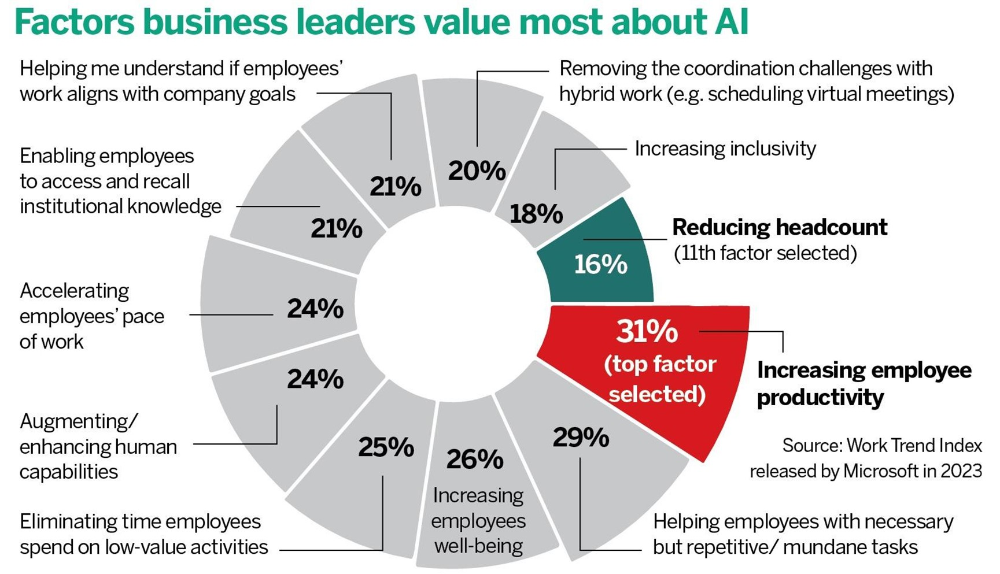
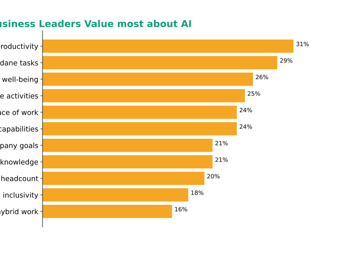

<h1 align=center> Lanzhou University </h1>
<h2 align=center>INFO 250: Information Visualization</h2>
<h3 align=center>Project 2</h3>

Group 3

Tiancheng Yang: 320210941581

Jiuyang Tian: 320210941761

Xiao Li: 320210941551

Zhiyuan Hong: 320210941651

 
<h2 align=center style="font-weight:bold">Nightingale's Rose Trap</h2>

## Abstract
_____________________
Data visualization is a technique for presenting data through graphs, charts, and other visual elements. Since the dawn of mankind, visualization through visual images has been an effective way to convey both abstract and concrete ideas. Our team uncovered a not-so-perfect visualization of a news commentary that used a Nightingale rose diagram to make a presentation of the factors that business leaders value most about artificial intelligence (AI). 
First, we introduce and analyze the need for the original visualization in practice, briefly listing the shortcomings of the original visualization and why we improved it.
Second, we detail the uses, strengths and weaknesses of the original visualization and how the original visualization relates to us. We also use cognitive theory to analyze certain aspects of the visualization. 
Then, we explain in detail how the original visualization can be improved using bar charts bar graphs. 
Finally we summarize the whole report and make some recommendations.

## Introduction
_____________________
Data visualization combines technology and art to help us extract knowledge from information and in turn harvest value from that knowledge. But more often than not, bad visualizations may intentionally or unintentionally mislead readers without them realizing it, because people put their trust in the prerequisites of visualization. Therefore, our team took the usually not-so-good visualizations and improved on them, without changing the author's original meaning or message, to make them more reliable to the data and better able to convey beyond the data itself more information. We hope that our work will inspire other visualization authors and make readers more aware of these visualization pitfalls during our revision process. 
Image from a press review article titled "Could supersmart machines replace humans?" (https://www.chinadailyhk.com/article/337270#Could-).  supersmart-machines-replace-humans). The article discusses the accelerating trend of self-learning in AI and the ethical and legal issues it may raise, citing concerns about trust in AI and its potential impact on employment, military applications, social stability and global security. At the same time, the article also touches on the positive impacts that the development of AI could have, such as empowering humans in certain areas and creating more efficient workflows. 
This image is from the section of the article that discusses the advantages of AI, where the author investigated the top 11 factors that business leaders value most about AI and chose to present this data in a Nightingale Rose chart:  

*Figure 1 Original Diagram*

The graphic appears primarily to provide the reader with the views of successful business people on the positives of AI so that the reader is left with a positive impression of AI, thus arguing that the development of AI is not a zero-sum game, and that AI allows for multiple interests to be mutually reinforcing, rather than being a constraining and mutually exclusive resource. We believe that there are a number of problems with presenting this information using this visualization as described above.
We chose it because it exemplifies a large news platform, China Daily, which has a large readership and readership. The many flaws of the original image can be very misleading to the readers, so the improvement of the original image is very important and necessary. 
Looking at the original image, we can see that it is presented in a complex way, which requires the reader to spend a lot of time to figure out what it wants to express and show. In addition, there are problems such as data relationships are not clearly represented, it contains deceptive elements, and the data are not clearly displayed. That's why we wanted to make it simple, clear and prioritized.

## Problems in original graph
_____________________

### 1. The Analysis of the Original Visualization
The original visualization (Figure 1) selects either a stacked polar area plot or a Nightingale rose plot to organize all the data together. Specifically, the different factors are presented in increasing order of data size, along the polar coordinates from counterclockwise.  
 
*Figure 2 Reproduction of the Original Graph*

### 2. Problems 

Visualization is only helpful if it is easy to understand. We must admit that this visualization is easier to understand than the data alone. Just looking at the data makes it more confusing, whereas a visualization chart is clear at a glance.
From the perspective of cognitive theory, visualization has its validity:
When a user clicks on the China Daily news for viewing viewing, without the use of charts and graphs, the viewer will look at it slowly due to the amount of information presented. And the visualization only shows the top eleven factors about artificial intelligence (AI) that companies are most interested in. So in this case, even without some specialized knowledge, the audience can understand what is being presented. And the novel format of the Nightingale Rose chart will make the audience feel comfortable.
#### Wrong Graphic Choice and Messaging
The biggest problem with the graphic, in our opinion, is in the choice of Nightingale's Rose Diagram to present the information. 
Nightingale's Rose Diagram was pioneered by British nursing pioneer and statistician Florence Nightingale in the mid-1800s. The chart is usually based on a circle that divides the data into sectors, with each sector representing a specific category or variable. Using the Nightingale Rose Chart, one can quickly compare the significant differences between each piece of data by using different angles and areas of the sectors. Also, the circular pattern is suitable for expressing data such as days of the week and months due to its periodicity. 
The purpose of this visualization graphic is to clearly convey to the reader a set of survey data about the advantages of AI, with a focus on conveying information to the reader about the advantageous aspects of AI.
However, the choice of the Nightingale Rose graphic for this information need poses the following problems:

- **1. Inaccurate communication of the key information need thus leading to elevated cognitive load** 
    Cognitive load refers to the ease with which a reader can access information when reading a visualization graphic. This is usually related to the reader's own knowledge storage and the way the visualization graphic presents the information. Since most readers are not experts in the field of visualization, we should try our best to use a way of presenting the visualization that is easily understood by the general public, so that the reader is able to understand what is being expressed using the graphic without additional explanation. 
    The greatest advantage of the use of the Nightingale rose diagram is that it is able to exaggerate the differences between each piece of data so that the reader is able to easily notice the difference, which is often critical information, so that the reader's transmission of the critical information is not impaired despite the elevated cognitive load of facing an unfamiliar spiral shape. However, the key message that the visualization is trying to convey is not to reflect the variability between each set of data, and the differences between the 11 data items in the set are not significant, with only almost a factor of one difference between the smallest percentage of data and the largest, and even more minimal differences between the data items in the middle rankings. This makes it impossible for the reader to notice the differences between these data items in an obvious way when looking at the graphic, thus losing the advantage of using the graphic. Although the original graphic uses red and green to emphasize the gap between the last 1 data and the first place data, this gap is not the main message the author wants to convey. The author wants the reader to gain information about AI's strengths in many areas, and looking at it this way, the reader would have to read through the content of the data in each rose petal. This requires the reader to read the text in an unaccustomed counterclockwise order with the interference of the graphics, which is extremely cognitively loaded for the reader. 
     
- **2. Confusion over key labeling information** 
    Another major problem with the graphic is the use of long textual content for each data item of the survey results and the fact that there are as many as 11 types of data items. The excessive number of data items as well as the textual content leads to the cluttered placement and formatting of the textual information throughout the graphic. At the same time, this textual clutter receives interference from the scale data of the graphic, thus exacerbating the level of confusion. It is uncomfortable and difficult for the reader to read through all the text content in such a graphic in the order of the circles. For readers using mobile readers, cluttered small-print text creates an even worse reading experience. 
     
- **3. The rose graphic is misleading in its differences** 
    The choice of this visualization graphic can be potentially misleading to readers. In this graphic, accent colors are used and the text content corresponding to the data is bolded. Although the "Reducing Headcount" data item is labeled as the 11th selected factor and is displayed in a darker color, the 16% percentage is not far below some of the other factors. This representation may mislead the reader's perception of its importance and direct the reader's attention to the comparative differences. As described in point 1, this communication of information is misleading and inaccurate.
      

In our opinion, it would be inefficient and unwise to use a Nightingale rose diagram to organize this data and convey such information.

## Improvement 
_____________________

We chose a horizontal bar graph to present the data and information needs of the group. Here is our improved graph:  
 
*Figure 3 Improved Diagram*

Our visualization has the following advantages over the original visualization:
 
 - **Reduces cognitive load and highlights the need for information**: We chose to present this data set in a horizontal bar graph. Readers are more familiar with such graphs, which reduces the cognitive load on the reader. This reduces the cognitive load on the reader, and the use of this graphic highlights long text to better convey key information to the reader.

 - **In line with the reader's reading habits**: the use of descending order of sorting method, which is more in line with the reader's reading order, more intuitive expression of the data content, which can also effectively reduce the cognitive load on the reader. At the same time, the neat long text information on the right side of the bar chart can reduce the degree of confusion of the text information, enhance the reading experience of the readers, and thus improve the efficiency of information conveyance.

 - **High data-ink ratio**: In this horizontal bar chart, we have deleted redundant axes and lines and simplified the lines and graphs, thus improving the data-ink ratio, making the whole graph clean and concise, and the key information clear at a glance.

 - **Appropriate Color and True Ratio**: In this graphic, we use a unified and coordinated color to display the title and columns separately. At the same time, the percentage of data items is directly labeled in this graphic, and the length of the columns is given in accordance with the real ratio in order to minimize the misleading to the readers and make the reading more intuitive and comfortable.

## Conclusion
_____________________

Visualization is important because it helps the reader to better understand the data, making it more vivid and meaningful. However, a wrong visualization can make the situation worse as it may be influenced by the limitations of the chart itself or the intentional guidance of the author, which can lead to misinformation.  
Therefore, as visualization creators, we should aim to correctly communicate the need for information behind the data, carefully choose the appropriate type of visualization, and present the data as realistically and transparently as possible in order to avoid misunderstanding or complicating the data.  
As readers, we should always maintain the ability to think independently and not overly rely on visualizations in order to make accurate and comprehensive judgments. 
We have published our work to our <a href=https://github.com/Izeral/INFO-250-project2-T3>Github</a>. Welcome to our Github and get the sharings!